# LAPORAN TUGAS REKAYASA PERANGKAT LUNAK (SOFTWARE ENGINEERING)
# SISTEM "FIND THE EXPERT (FTE)"
**Platform Kolaborasi, Konsultasi, & Mentoring Berbasis Geolokasi Presisi**

---

### 🔑 Informasi Akun Pengujian (Demo Accounts)
Untuk keperluan pengujian sistem dan evaluasi fitur, dapat menggunakan kredensial berikut:

* **User Biasa (Klien / Pencari Ahli):**
  * Email: `aulia@gmail.com` | Password: `password123` (atau `123456`)
  * Email: `marshanda@gmail.com` | Password: `password123` (atau `123456`)
* **User Ahli (Expert / Mentor):**
  * Email: `george@gmail.com` | Password: `password123` (atau `123456`)

---

# BAB 1: ANALISIS KEBUTUHAN

## 1.1 Ruang Lingkup
Proyek pengembangan perangkat lunak **Find The Expert (FTE)** adalah sebuah platform berbasis web responsif (*progressive web platform*) yang dirancang untuk menjembatani kebutuhan konsultasi profesional antara masyarakat umum (*Client / User Biasa*) dengan para praktisi dan mentor bersertifikasi (*Expert / Ahli*) di bidang Teknologi Informasi (IT). 

Ruang lingkup sistem ini mencakup:
1. **Pendaftaran dan Autentikasi Pengguna**: Registrasi akun terpisah berdasarkan peran (*Role-Based Access Control* - RBAC: `USER_BIASA` dan `AHLI`), proses masuk (*login*), pengelolaan sesi (*session management*), serta personalisasi profil pengguna.
2. **Pencarian dan Penemuan Mentor Berbasis Geospasial**: Penentuan posisi pengguna melalui koordinat GPS (Latitude & Longitude), visualisasi sebaran mentor di peta interaktif, filter radius jarak dinamis (5 km s/d 50 km) dengan algoritma *Haversine Formula*, estimasi waktu tempuh berkendara (*Estimated Time of Arrival* / ETA), dan penyaringan berdasarkan kategori bidang keahlian IT (Software Engineering & Web, Mobile App Development, UI/UX & Product Design, Data Science & AI, Cybersecurity & Network, Cloud & DevOps, Robotics & IoT, dll).
3. **Portofolio & Publikasi Karya Ilmiah/Praktis**: Manajemen artikel, studi kasus, karya, sertifikasi, riwayat pendidikan, dan pencapaian profesional oleh mentor ahli dengan optimasi kompresi gambar otomatis.
4. **Komunikasi Langsung & Real-Time**: Fasilitas pesan instan (*Direct Chat*) satu-lawan-satu secara *real-time* berbasis *reactive WebSocket*, indikator status pesan terbaca (*read receipts*), serta badge pesan belum dibaca.
5. **Sistem Reputasi, Penilaian, & Ulasan**: Pemberian rating bintang (skala 1–5), testimoni ulasan dari klien kepada mentor terverifikasi, serta fitur apresiasi komunitas berupa *Like Profile* dan *Like Postingan*.

Fokus wilayah implementasi percontohan (*pilot region*) adalah wilayah Provinsi Sulawesi Utara dan sekitarnya (Manado, Tomohon, Bitung, Minahasa, Minahasa Utara, Kotamobagu, Likupang DPSP), namun arsitektur sistem dirancang dapat diperluas ke seluruh Indonesia.

---

## 1.2 Tujuan Sistem
Pengembangan sistem Find The Expert (FTE) bertujuan untuk:
1. **Mengurangi Kesenjangan Akses Keahlian**: Mempermudah masyarakat dalam menemukan tenaga ahli, konsultan, dan mentor berkualitas tinggi yang berada di sekitar lokasi terdekat mereka.
2. **Menyediakan Platform Portofolio Terverifikasi**: Memberikan wadah kredibel bagi para profesional dan akademisi lokal untuk mempublikasikan kompetensi, sertifikasi, studi kasus, serta rekam jejak mereka.
3. **Meningkatkan Efisiensi Konsultasi Real-Time**: Mengeliminasi hambatan komunikasi dengan menyediakan saluran percakapan instan tanpa jeda (*zero latency*) untuk tanya-jawab dan penjadwalan mentoring.
4. **Membangun Ekosistem Kepercayaan (Trust & Reputation)**: Mengintegrasikan sistem *social proof* melalui validasi badge terverifikasi, rating kuantitatif, testimoni kualitatif, serta metrik apresiasi komunitas.

---

## 1.3 Identifikasi Aktor
Sistem FTE mengidentifikasi 3 (tiga) aktor utama yang berinteraksi dalam ekosistem aplikasi:

| No | Aktor | Deskripsi Peran & Tanggung Jawab |
|:---|:---|:---|
| 1 | **User Biasa (Klien / Pencari Ahli)** | Pengguna yang mencari bantuan, saran, atau jasa konsultasi. Klien dapat menjelajahi peta, memfilter ahli berdasarkan jarak dan kategori, melihat profil detail, mengirim pesan instan, memberikan *like*, serta mengirimkan ulasan dan rating bintang kepada ahli setelah sesi konsultasi. |
| 2 | **User Ahli (Expert / Mentor)** | Pengguna terdaftar yang memiliki kompetensi di bidang tertentu. Ahli dapat mengelola portofolio profesional, mempublikasikan karya/studi kasus beserta foto terkompresi, mencantumkan sertifikasi dan riwayat pendidikan, menerima dan membalas konsultasi pesan dari klien, serta memantau statistik ulasan dan reputasi mereka. |
| 3 | **Sistem Backend (Convex Serverless BaaS)** | Entitas sistem yang menangani pemrosesan logika bisnis, validasi tipe data mutasi (*type-safe validator*), sinkronisasi data reaktif secara *real-time* ke klien via WebSocket, pengindeksan database, kalkulasi agregasi rating, serta pengelolaan penyimpanan data. |

---

## 1.4 Kebutuhan Fungsional (Functional Requirements)
Kebutuhan fungsional dijabarkan dengan kodefikasi spesifikasi kebutuhan perangkat lunak (SKPL / SRS):

| ID Kebutuhan | Deskripsi Kebutuhan Fungsional | Aktor Terkait |
|:---|:---|:---|
| **FR-01** | Pengguna dapat melakukan registrasi akun baru dengan memilih peran sebagai `USER_BIASA` atau `AHLI`, serta mengisi data identitas awal dan koordinat lokasi. | Klien, Ahli |
| **FR-02** | Pengguna dapat melakukan login menggunakan email dan password untuk masuk ke dalam sesi aplikasi. | Klien, Ahli |
| **FR-03** | Pengguna dapat memperbarui data profil pribadi (nama, bio, nomor telepon, wilayah, avatar, sertifikasi, dan pendidikan) serta menyetel lokasi GPS. | Klien, Ahli |
| **FR-04** | Pengguna Klien dapat menjelajahi peta interaktif Leaflet serta memfilter ahli berdasarkan radius jarak (5 km – 50 km) via rumus *Haversine* dan kategori bidang. | Klien |
| **FR-05** | Pengguna dapat melihat halaman profil lengkap mentor termasuk bio, pengalaman kerja, sertifikasi, keahlian tags, rating rata-rata, dan portofolio. | Klien, Ahli |
| **FR-06** | Pengguna dapat memberikan apresiasi *Like* pada profil mentor dan postingan karya. | Klien, Ahli |
| **FR-07** | Pengguna Ahli dapat membuat, memperbarui, dan menghapus postingan studi kasus / portofolio karya beserta unggahan foto media terkompresi otomatis. | Ahli |
| **FR-08** | Pengguna Klien dan Ahli dapat melakukan percakapan langsung (*Direct Chat*) secara *real-time* dua arah dengan indikator status terbaca. | Klien, Ahli |
| **FR-09** | Pengguna Klien dapat memberikan ulasan tertulis dan rating bintang (1–5) pada profil ahli, yang secara otomatis memperbarui nilai rating rata-rata ahli. | Klien |

---

## 1.5 Kebutuhan Non-Fungsional (Non-Functional Requirements)
Kebutuhan non-fungsional disusun menggunakan model klasifikasi **FURPS+** (*Functionality, Usability, Reliability, Performance, Supportability*):

1. **Usability (Kegunaan & Antarmuka)**:
   - Antarmuka mengusung tema modern dengan prinsip *Glassmorphism*, transisi halus (*micro-interactions*), dan tipografi yang jelas (*Inter font*).
   - Desain responsif (*mobile-first*) yang dapat diakses dengan optimal pada perangkat ponsel pintar, tablet, maupun layar desktop.
   - Peta interaktif memiliki kontrol zoom yang intuitif, pin marker kustom dengan foto profil avatar ahli, dan lingkaran visual radius pencarian (*circle overlay*).

2. **Reliability (Keandalan)**:
   - Ketersediaan backend reaktif (*high availability*) didukung oleh infrastruktur Convex Serverless Cloud.
   - Penanganan kegagalan koneksi geolokasi (*fallback location*) diarahkan secara aman ke titik koordinat ibukota provinsi (Manado: `1.4748, 124.8428`).

3. **Performance (Kinerja & Efisiensi)**:
   - Waktu respons pengiriman pesan instan *real-time* di bawah 200 ms menggunakan transmisi WebSocket bawaan Convex.
   - Kompresi gambar sisi klien (*client-side canvas compression*) membatasi lebar maksimum 1280px dan rasio kompresi JPEG 82%, mengurangi ukuran berkas hingga 85% sebelum transmisi data.
   - Perhitungan jarak ratusan titik koordinat ahli menggunakan *Haversine Formula* dieksekusi secara instan (< 10 ms) pada sisi browser.

4. **Security & Data Integrity (Keamanan & Integritas)**:
   - Validasi skema data ketat (*schema validation*) pada setiap query dan mutasi menggunakan validator `v.string()`, `v.number()`, `v.union()`, dan `v.optional()`.
   - Hak akses data dibatasi berdasarkan peran (misal: hanya akun `AHLI` yang dapat memicu mutasi pembuatan portofolio).

5. **Supportability & Maintainability (Dukungan Pemeliharaan)**:
   - Arsitektur kode berbasis komponen modular React dan Next.js 14 App Router.
   - Pengetikan variabel dan struktur antarmuka bersifat *Type-Safe* secara menyeluruh (*End-to-End Type Safety*) dengan TypeScript.

---

## 1.6 Batasan Sistem (System Constraints)
1. **Platform**: Berjalan pada peramban web modern yang mendukung HTML5, CSS Grid/Flexbox, JavaScript ES6+, dan WebSocket (Google Chrome, Mozilla Firefox, Microsoft Edge, Apple Safari).
2. **Koneksi Jaringan**: Memerlukan konektivitas internet aktif untuk sinkronisasi data reaktif dengan Convex Backend Cloud dan pemuatan *tile layer* OpenStreetMap.
3. **Format Unggahan Gambar**: Kompresi otomatis mendukung citra bertipe JPEG, PNG, dan WebP.
4. **Penyimpanan Berkas**: Data gambar terkompresi disimpan dalam basis data dokumen reaktif sebagai representasi data URI base64 / string CDN yang efisien.
5. **Cakupan Wilayah Default**: Titik koordinat awal dan daftar preset kota difokuskan pada wilayah Sulawesi Utara (Manado, Tomohon, Bitung, Minahasa, Minahasa Utara, Kotamobagu, Likupang).
6. **Ruang Lingkup Bidang Keahlian**: Batasan sistem dibatasi secara eksklusif pada praktisi dan bidang keahlian **Teknologi Informasi (IT)** beserta sub-disiplinnya (Software Engineering & Web, Mobile App Development, UI/UX & Product Design, Data Science & AI, Cybersecurity & Network, Cloud & DevOps, Robotics & Applied IoT, Database & Systems Architecture, serta IT Support).

---

# BAB 2: PEMODELAN DAN DESAIN SISTEM

## 2.1 Use Case Diagram

Sistem memiliki **9 fitur utama (Use Cases)** yang memfasilitasi kebutuhan Klien (*User Biasa*) dan Mentor (*Ahli*):

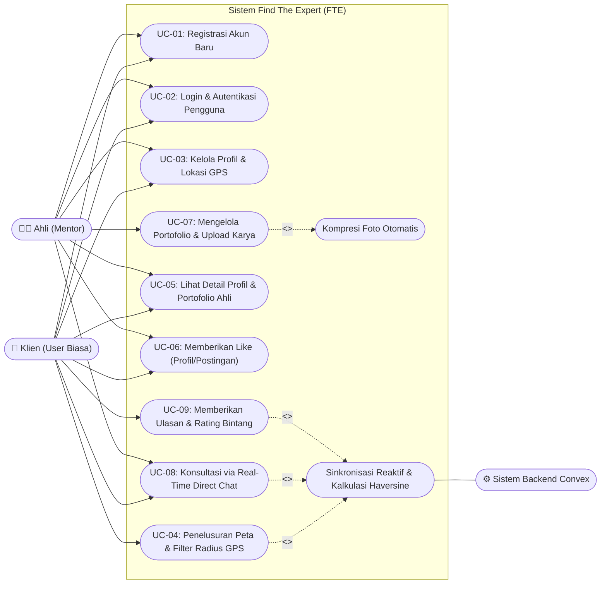
```mermaid
flowchart LR
    subgraph FTE_System ["Sistem Find The Expert (FTE)"]
        UC1(["UC-01: Registrasi Akun Baru"])
        UC2(["UC-02: Login & Autentikasi Pengguna"])
        UC3(["UC-03: Kelola Profil & Lokasi GPS"])
        UC4(["UC-04: Penelusuran Peta & Filter Radius GPS"])
        UC5(["UC-05: Lihat Detail Profil & Portofolio Ahli"])
        UC6(["UC-06: Memberikan Like (Profil/Postingan)"])
        UC7(["UC-07: Mengelola Portofolio & Upload Karya"])
        UC8(["UC-08: Konsultasi via Real-Time Direct Chat"])
        UC9(["UC-09: Memberikan Ulasan & Rating Bintang"])
        
        UC_Comp(["Kompresi Foto Otomatis"])
        UC_Sync(["Sinkronisasi Reaktif & Kalkulasi Haversine"])
    end

    Client(["👤 Klien (User Biasa)"])
    Expert(["👨‍💼 Ahli (Mentor)"])
    System(["⚙️ Sistem Backend Convex"])

    Client --> UC1
    Client --> UC2
    Client --> UC3
    Client --> UC4
    Client --> UC5
    Client --> UC6
    Client --> UC8
    Client --> UC9

    Expert --> UC1
    Expert --> UC2
    Expert --> UC3
    Expert --> UC5
    Expert --> UC6
    Expert --> UC7
    Expert --> UC8

    UC7 -.->|<<include>>| UC_Comp
    UC4 -.->|<<include>>| UC_Sync
    UC8 -.->|<<include>>| UC_Sync
    UC9 -.->|<<include>>| UC_Sync

    UC_Sync --- System
```

### 📋 Prompt / Kode PlantUML untuk Use Case Diagram
*(Salin kode di bawah ini ke [PlantText](https://www.planttext.com/), [PlantUML Editor](https://www.plantuml.com/plantuml/), atau Importer draw.io)*

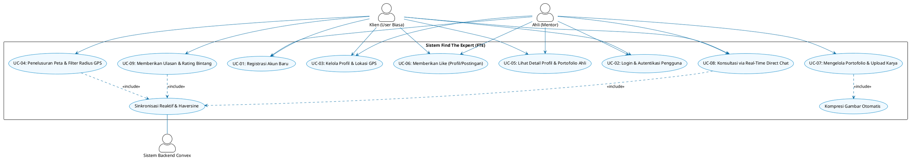
```plantuml
@startuml
!theme plain
skinparam packageStyle rectangle
skinparam actorStyle awesome
skinparam usecase {
    BackgroundColor #F0F9FF
    BorderColor #0284C7
    ArrowColor #0369A1
}

actor "Klien (User Biasa)" as Client
actor "Ahli (Mentor)" as Expert
actor "Sistem Backend Convex" as System

rectangle "Sistem Find The Expert (FTE)" {
    usecase "UC-01: Registrasi Akun Baru" as UC1
    usecase "UC-02: Login & Autentikasi Pengguna" as UC2
    usecase "UC-03: Kelola Profil & Lokasi GPS" as UC3
    usecase "UC-04: Penelusuran Peta & Filter Radius GPS" as UC4
    usecase "UC-05: Lihat Detail Profil & Portofolio Ahli" as UC5
    usecase "UC-06: Memberikan Like (Profil/Postingan)" as UC6
    usecase "UC-07: Mengelola Portofolio & Upload Karya" as UC7
    usecase "UC-08: Konsultasi via Real-Time Direct Chat" as UC8
    usecase "UC-09: Memberikan Ulasan & Rating Bintang" as UC9
    
    usecase "Kompresi Gambar Otomatis" as UC_Comp
    usecase "Sinkronisasi Reaktif & Haversine" as UC_Sync
}

Client --> UC1
Client --> UC2
Client --> UC3
Client --> UC4
Client --> UC5
Client --> UC6
Client --> UC8
Client --> UC9

Expert --> UC1
Expert --> UC2
Expert --> UC3
Expert --> UC5
Expert --> UC6
Expert --> UC7
Expert --> UC8

UC7 ..> UC_Comp : <<include>>
UC4 ..> UC_Sync : <<include>>
UC8 ..> UC_Sync : <<include>>
UC9 ..> UC_Sync : <<include>>

UC_Sync -- System
@enduml
```

---

### 2.1.1 Deskripsi Setiap Use Case

| No | ID Use Case | Nama Use Case | Aktor Utama | Deskripsi Singkat | Pre-Condition | Post-Condition |
|:---|:---|:---|:---|:---|:---|:---|
| 1 | **UC-01** | Registrasi Akun Baru | Klien, Ahli | Mendaftar akun baru dengan memilih peran (`USER_BIASA` atau `AHLI`), mengisi nama, email, password, dan koordinat awal. | Pengguna belum memiliki akun aktif. | Akun terdaftar di database dan otomatis masuk ke sesi sistem. |
| 2 | **UC-02** | Login & Autentikasi | Klien, Ahli | Masuk ke sistem menggunakan email dan password yang terdaftar. | Pengguna sudah memiliki akun terdaftar. | Pengguna terautentikasi dan diarahkan ke Dashboard/Beranda. |
| 3 | **UC-03** | Kelola Profil & Lokasi GPS | Klien, Ahli | Mengubah biodata, foto avatar, nomor telepon, sertifikasi, keahlian, dan menyetel titik koordinat GPS. | Pengguna telah login. | Data profil dan koordinat lokasi diperbarui di database. |
| 4 | **UC-04** | Penelusuran Peta & Filter Radius | Klien | Menjelajahi peta sebaran ahli, memfilter jarak radius (5–50 km) via Haversine, dan memilih kategori keahlian. | Klien telah login dan berada di halaman `/find`. | Peta menampilkan pin marker dan daftar ahli sesuai kriteria filter. |
| 5 | **UC-05** | Lihat Detail Profil & Portofolio Ahli | Klien, Ahli | Membuka halaman detail mentor untuk membaca biografi, lisensi, artikel portofolio, dan testimoni ulasan. | Pengguna memilih salah satu profil ahli. | Halaman detail ahli ditampilkan secara lengkap. |
| 6 | **UC-06** | Memberikan Like (Profil/Post) | Klien, Ahli | Memberikan apresiasi *Like* pada profil mentor atau postingan artikel karya. | Pengguna telah login. | Nilai counter like bertambah dan tersinkronisasi secara real-time. |
| 7 | **UC-07** | Mengelola Portofolio & Publikasi | Ahli | Membuat postingan karya baru (disertai kompresi foto otomatis), mengedit, atau menghapus postingan. | Pengguna login dengan peran `AHLI`. | Postingan tersimpan/terhapus dan tampil pada feed komunitas. |
| 8 | **UC-08** | Konsultasi Real-Time Direct Chat | Klien, Ahli | Mengirim dan menerima pesan konsultasi instan dua arah berbasis WebSocket dengan tanda baca (*read receipts*). | Kedua pengguna telah terdaftar di sistem. | Pesan terkirim secara instan dan riwayat chat tersimpan. |
| 9 | **UC-09** | Memberikan Ulasan & Rating Bintang | Klien | Memberikan penilaian 1–5 bintang beserta ulasan testimoni pada profil mentor setelah sesi konsultasi. | Klien telah login dengan peran `USER_BIASA`. | Ulasan tersimpan dan rating rata-rata mentor dihitung ulang secara otomatis. |

---

## 2.2 Activity Diagram (Berdasarkan 9 Fitur Use Case)

### 2.2.1 Activity Diagram UC-01: Registrasi Akun Baru

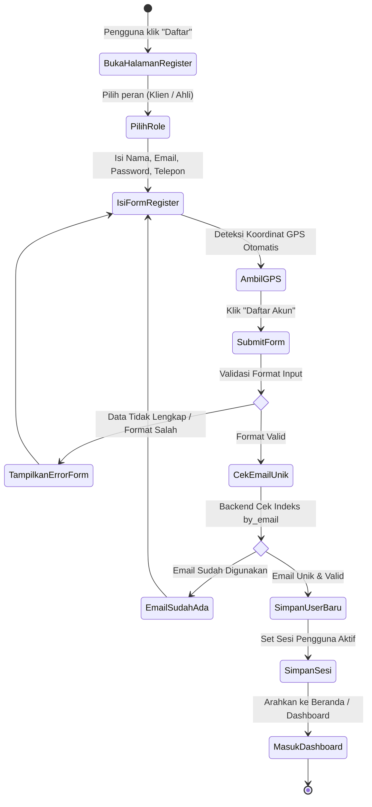
```mermaid
stateDiagram-v2
    [*] --> BukaHalamanRegister: Pengguna klik "Daftar"
    BukaHalamanRegister --> PilihRole: Pilih peran (Klien / Ahli)
    PilihRole --> IsiFormRegister: Isi Nama, Email, Password, Telepon
    IsiFormRegister --> AmbilGPS: Deteksi Koordinat GPS Otomatis
    AmbilGPS --> SubmitForm: Klik "Daftar Akun"
    
    state ValidasiInput <<choice>>
    SubmitForm --> ValidasiInput: Validasi Format Input
    ValidasiInput --> TampilkanErrorForm: Data Tidak Lengkap / Format Salah
    TampilkanErrorForm --> IsiFormRegister
    
    ValidasiInput --> CekEmailUnik: Format Valid
    
    state ValidasiEmail <<choice>>
    CekEmailUnik --> ValidasiEmail: Backend Cek Indeks by_email
    ValidasiEmail --> EmailSudahAda: Email Sudah Digunakan
    EmailSudahAda --> IsiFormRegister
    
    ValidasiEmail --> SimpanUserBaru: Email Unik & Valid
    SimpanUserBaru --> SimpanSesi: Set Sesi Pengguna Aktif
    SimpanSesi --> MasukDashboard: Arahkan ke Beranda / Dashboard
    MasukDashboard --> [*]
```

#### 📋 Prompt / Kode PlantUML: Activity Diagram UC-01
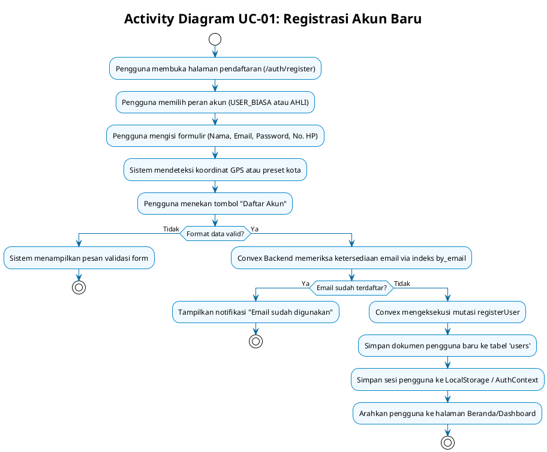
```plantuml
@startuml
!theme plain
skinparam ActivityBackgroundColor #F0F9FF
skinparam ActivityBorderColor #0284C7
skinparam ArrowColor #0369A1

title Activity Diagram UC-01: Registrasi Akun Baru

start
:Pengguna membuka halaman pendaftaran (/auth/register);
:Pengguna memilih peran akun (USER_BIASA atau AHLI);
:Pengguna mengisi formulir (Nama, Email, Password, No. HP);
:Sistem mendeteksi koordinat GPS atau preset kota;
:Pengguna menekan tombol "Daftar Akun";

if (Format data valid?) then (Tidak)
    :Sistem menampilkan pesan validasi form;
    stop
else (Ya)
    :Convex Backend memeriksa ketersediaan email via indeks by_email;
    if (Email sudah terdaftar?) then (Ya)
        :Tampilkan notifikasi "Email sudah digunakan";
        stop
    else (Tidak)
        :Convex mengeksekusi mutasi registerUser;
        :Simpan dokumen pengguna baru ke tabel 'users';
        :Simpan sesi pengguna ke LocalStorage / AuthContext;
        :Arahkan pengguna ke halaman Beranda/Dashboard;
        stop
    endif
endif
@enduml
```

---

### 2.2.2 Activity Diagram UC-02: Login & Autentikasi Pengguna

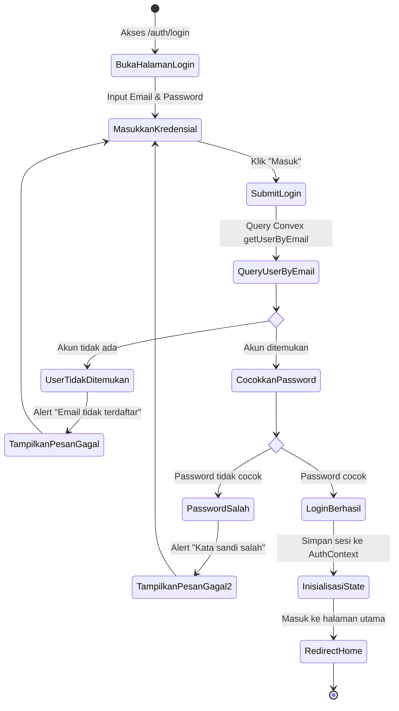
```mermaid
stateDiagram-v2
    [*] --> BukaHalamanLogin: Akses /auth/login
    BukaHalamanLogin --> MasukkanKredensial: Input Email & Password
    MasukkanKredensial --> SubmitLogin: Klik "Masuk"
    
    SubmitLogin --> QueryUserByEmail: Query Convex getUserByEmail
    
    state CekUser <<choice>>
    QueryUserByEmail --> CekUser
    CekUser --> UserTidakDitemukan: Akun tidak ada
    UserTidakDitemukan --> TampilkanPesanGagal: Alert "Email tidak terdaftar"
    TampilkanPesanGagal --> MasukkanKredensial
    
    CekUser --> CocokkanPassword: Akun ditemukan
    
    state CekPassword <<choice>>
    CocokkanPassword --> CekPassword
    CekPassword --> PasswordSalah: Password tidak cocok
    PasswordSalah --> TampilkanPesanGagal2: Alert "Kata sandi salah"
    TampilkanPesanGagal2 --> MasukkanKredensial
    
    CekPassword --> LoginBerhasil: Password cocok
    LoginBerhasil --> InisialisasiState: Simpan sesi ke AuthContext
    InisialisasiState --> RedirectHome: Masuk ke halaman utama
    RedirectHome --> [*]
```

#### 📋 Prompt / Kode PlantUML: Activity Diagram UC-02
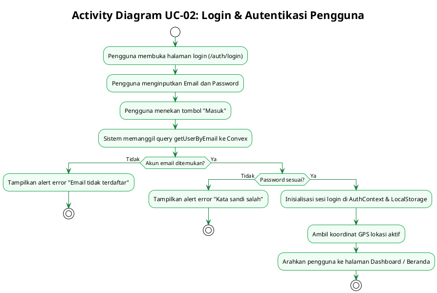
```plantuml
@startuml
!theme plain
skinparam ActivityBackgroundColor #F0FDF4
skinparam ActivityBorderColor #16A34A
skinparam ArrowColor #15803D

title Activity Diagram UC-02: Login & Autentikasi Pengguna

start
:Pengguna membuka halaman login (/auth/login);
:Pengguna menginputkan Email dan Password;
:Pengguna menekan tombol "Masuk";

:Sistem memanggil query getUserByEmail ke Convex;
if (Akun email ditemukan?) then (Tidak)
    :Tampilkan alert error "Email tidak terdaftar";
    stop
else (Ya)
    if (Password sesuai?) then (Tidak)
        :Tampilkan alert error "Kata sandi salah";
        stop
    else (Ya)
        :Inisialisasi sesi login di AuthContext & LocalStorage;
        :Ambil koordinat GPS lokasi aktif;
        :Arahkan pengguna ke halaman Dashboard / Beranda;
        stop
    endif
endif
@enduml
```

---

### 2.2.3 Activity Diagram UC-03: Kelola Profil & Lokasi GPS

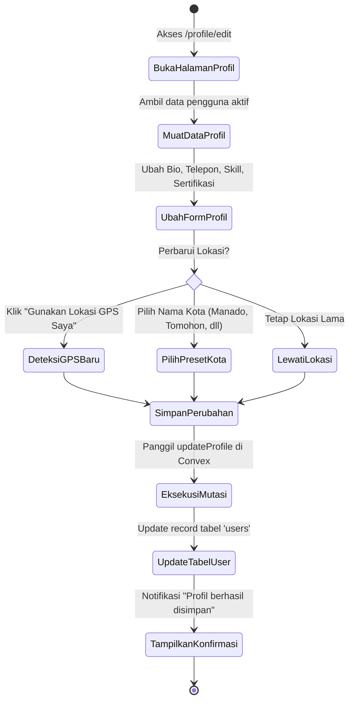
```mermaid
stateDiagram-v2
    [*] --> BukaHalamanProfil: Akses /profile/edit
    BukaHalamanProfil --> MuatDataProfil: Ambil data pengguna aktif
    MuatDataProfil --> UbahFormProfil: Ubah Bio, Telepon, Skill, Sertifikasi
    
    state OpsiLokasi <<choice>>
    UbahFormProfil --> OpsiLokasi: Perbarui Lokasi?
    OpsiLokasi --> DeteksiGPSBaru: Klik "Gunakan Lokasi GPS Saya"
    OpsiLokasi --> PilihPresetKota: Pilih Nama Kota (Manado, Tomohon, dll)
    OpsiLokasi --> LewatiLokasi: Tetap Lokasi Lama
    
    DeteksiGPSBaru --> SimpanPerubahan
    PilihPresetKota --> SimpanPerubahan
    LewatiLokasi --> SimpanPerubahan
    
    SimpanPerubahan --> EksekusiMutasi: Panggil updateProfile di Convex
    EksekusiMutasi --> UpdateTabelUser: Update record tabel 'users'
    UpdateTabelUser --> TampilkanKonfirmasi: Notifikasi "Profil berhasil disimpan"
    TampilkanKonfirmasi --> [*]
```

#### 📋 Prompt / Kode PlantUML: Activity Diagram UC-03
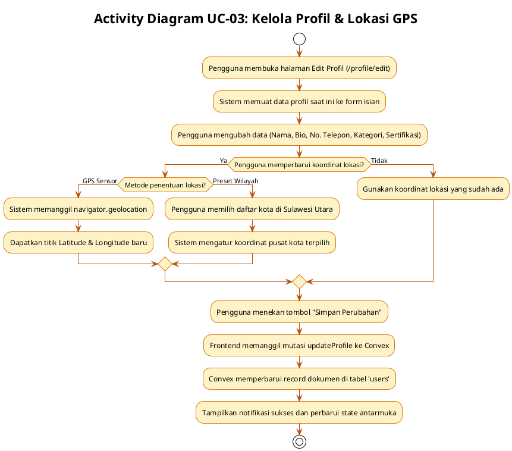
```plantuml
@startuml
!theme plain
skinparam ActivityBackgroundColor #FEF3C7
skinparam ActivityBorderColor #D97706
skinparam ArrowColor #B45309

title Activity Diagram UC-03: Kelola Profil & Lokasi GPS

start
:Pengguna membuka halaman Edit Profil (/profile/edit);
:Sistem memuat data profil saat ini ke form isian;
:Pengguna mengubah data (Nama, Bio, No. Telepon, Kategori, Sertifikasi);

if (Pengguna memperbarui koordinat lokasi?) then (Ya)
    if (Metode penentuan lokasi?) then (GPS Sensor)
        :Sistem memanggil navigator.geolocation;
        :Dapatkan titik Latitude & Longitude baru;
    else (Preset Wilayah)
        :Pengguna memilih daftar kota di Sulawesi Utara;
        :Sistem mengatur koordinat pusat kota terpilih;
    endif
else (Tidak)
    :Gunakan koordinat lokasi yang sudah ada;
endif

:Pengguna menekan tombol "Simpan Perubahan";
:Frontend memanggil mutasi updateProfile ke Convex;
:Convex memperbarui record dokumen di tabel 'users';
:Tampilkan notifikasi sukses dan perbarui state antarmuka;
stop
@enduml
```

---

### 2.2.4 Activity Diagram UC-04: Penelusuran Peta & Filter Radius Geospasial

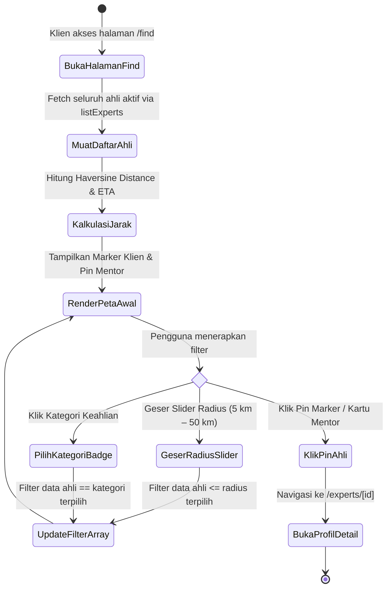
```mermaid
stateDiagram-v2
    [*] --> BukaHalamanFind: Klien akses halaman /find
    BukaHalamanFind --> MuatDaftarAhli: Fetch seluruh ahli aktif via listExperts
    MuatDaftarAhli --> KalkulasiJarak: Hitung Haversine Distance & ETA
    KalkulasiJarak --> RenderPetaAwal: Tampilkan Marker Klien & Pin Mentor
    
    state InteraksiFilter <<choice>>
    RenderPetaAwal --> InteraksiFilter: Pengguna menerapkan filter
    InteraksiFilter --> GeserRadiusSlider: Geser Slider Radius (5 km – 50 km)
    InteraksiFilter --> PilihKategoriBadge: Klik Kategori Keahlian
    InteraksiFilter --> KlikPinAhli: Klik Pin Marker / Kartu Mentor
    
    GeserRadiusSlider --> UpdateFilterArray: Filter data ahli <= radius terpilih
    PilihKategoriBadge --> UpdateFilterArray: Filter data ahli == kategori terpilih
    UpdateFilterArray --> RenderPetaAwal
    
    KlikPinAhli --> BukaProfilDetail: Navigasi ke /experts/[id]
    BukaProfilDetail --> [*]
```

#### 📋 Prompt / Kode PlantUML: Activity Diagram UC-04
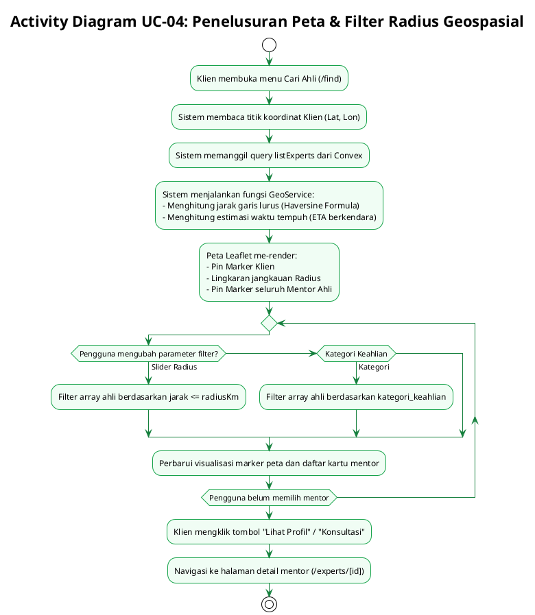
```plantuml
@startuml
!theme plain
skinparam ActivityBackgroundColor #F0FDF4
skinparam ActivityBorderColor #16A34A
skinparam ArrowColor #15803D

title Activity Diagram UC-04: Penelusuran Peta & Filter Radius Geospasial

start
:Klien membuka menu Cari Ahli (/find);
:Sistem membaca titik koordinat Klien (Lat, Lon);
:Sistem memanggil query listExperts dari Convex;

:Sistem menjalankan fungsi GeoService:
- Menghitung jarak garis lurus (Haversine Formula)
- Menghitung estimasi waktu tempuh (ETA berkendara);

:Peta Leaflet me-render:
- Pin Marker Klien
- Lingkaran jangkauan Radius
- Pin Marker seluruh Mentor Ahli;

repeat
    if (Pengguna mengubah parameter filter?) then (Slider Radius)
        :Filter array ahli berdasarkan jarak <= radiusKm;
    elseif (Kategori Keahlian) then (Kategori)
        :Filter array ahli berdasarkan kategori_keahlian;
    endif
    :Perbarui visualisasi marker peta dan daftar kartu mentor;
repeat while (Pengguna belum memilih mentor)

:Klien mengklik tombol "Lihat Profil" / "Konsultasi";
:Navigasi ke halaman detail mentor (/experts/[id]);
stop
@enduml
```

---

### 2.2.5 Activity Diagram UC-05: Melihat Detail Profil & Portofolio Ahli

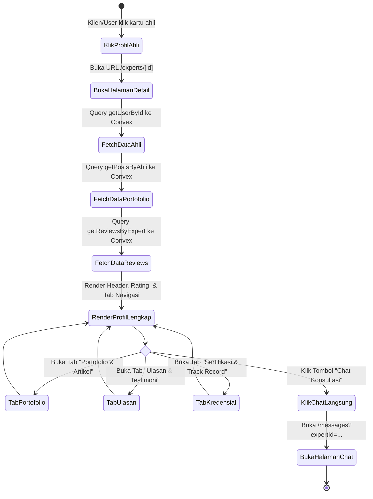
```mermaid
stateDiagram-v2
    [*] --> KlikProfilAhli: Klien/User klik kartu ahli
    KlikProfilAhli --> BukaHalamanDetail: Buka URL /experts/[id]
    BukaHalamanDetail --> FetchDataAhli: Query getUserById ke Convex
    FetchDataAhli --> FetchDataPortofolio: Query getPostsByAhli ke Convex
    FetchDataPortofolio --> FetchDataReviews: Query getReviewsByExpert ke Convex
    
    FetchDataReviews --> RenderProfilLengkap: Render Header, Rating, & Tab Navigasi
    
    state NavigasiTab <<choice>>
    RenderProfilLengkap --> NavigasiTab
    NavigasiTab --> TabPortofolio: Buka Tab "Portofolio & Artikel"
    NavigasiTab --> TabUlasan: Buka Tab "Ulasan & Testimoni"
    NavigasiTab --> TabKredensial: Buka Tab "Sertifikasi & Track Record"
    NavigasiTab --> KlikChatLangsung: Klik Tombol "Chat Konsultasi"
    
    TabPortofolio --> RenderProfilLengkap
    TabUlasan --> RenderProfilLengkap
    TabKredensial --> RenderProfilLengkap
    
    KlikChatLangsung --> BukaHalamanChat: Buka /messages?expertId=...
    BukaHalamanChat --> [*]
```

#### 📋 Prompt / Kode PlantUML: Activity Diagram UC-05
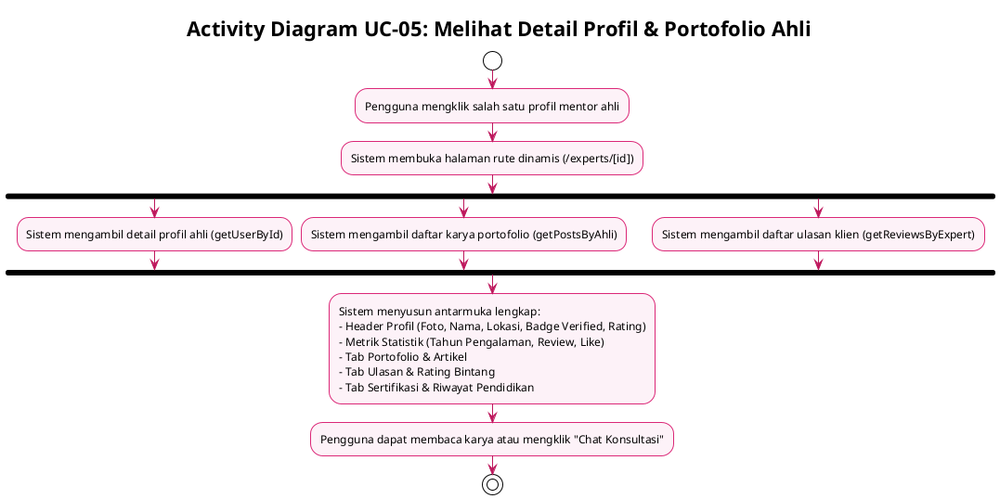
```plantuml
@startuml
!theme plain
skinparam ActivityBackgroundColor #FDF2F8
skinparam ActivityBorderColor #DB2777
skinparam ArrowColor #BE185D

title Activity Diagram UC-05: Melihat Detail Profil & Portofolio Ahli

start
:Pengguna mengklik salah satu profil mentor ahli;
:Sistem membuka halaman rute dinamis (/experts/[id]);

fork
    :Sistem mengambil detail profil ahli (getUserById);
fork again
    :Sistem mengambil daftar karya portofolio (getPostsByAhli);
fork again
    :Sistem mengambil daftar ulasan klien (getReviewsByExpert);
end fork

:Sistem menyusun antarmuka lengkap:
- Header Profil (Foto, Nama, Lokasi, Badge Verified, Rating)
- Metrik Statistik (Tahun Pengalaman, Review, Like)
- Tab Portofolio & Artikel
- Tab Ulasan & Rating Bintang
- Tab Sertifikasi & Riwayat Pendidikan;

:Pengguna dapat membaca karya atau mengklik "Chat Konsultasi";
stop
@enduml
```

---

### 2.2.6 Activity Diagram UC-06: Memberikan Like pada Profil & Postingan

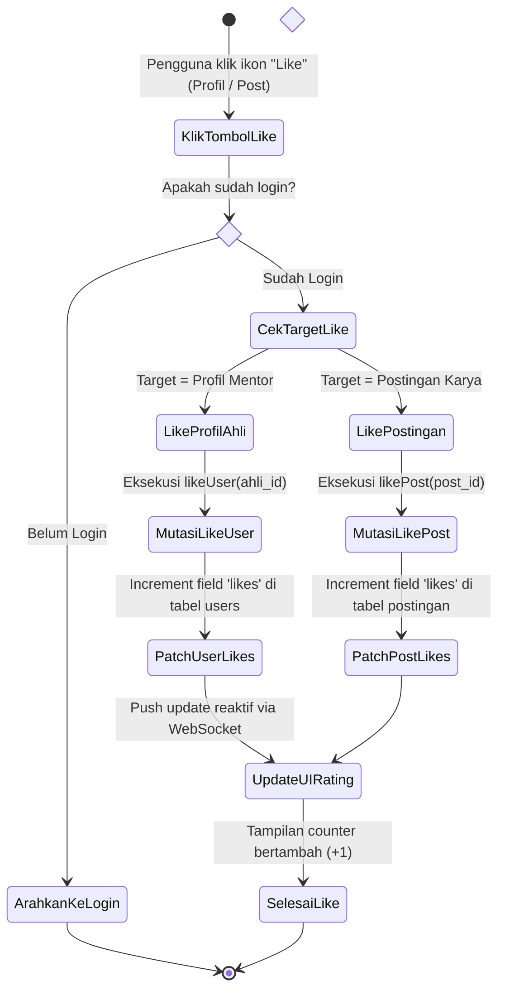
```mermaid
stateDiagram-v2
    [*] --> KlikTombolLike: Pengguna klik ikon "Like" (Profil / Post)
    
    state CekLogin <<choice>>
    KlikTombolLike --> CekLogin: Apakah sudah login?
    CekLogin --> ArahkanKeLogin: Belum Login
    ArahkanKeLogin --> [*]
    
    CekLogin --> CekTargetLike: Sudah Login
    
    state TargetLike <<choice>>
    CekTargetLike --> LikeProfilAhli: Target = Profil Mentor
    CekTargetLike --> LikePostingan: Target = Postingan Karya
    
    LikeProfilAhli --> MutasiLikeUser: Eksekusi likeUser(ahli_id)
    MutasiLikeUser --> PatchUserLikes: Increment field 'likes' di tabel users
    
    LikePostingan --> MutasiLikePost: Eksekusi likePost(post_id)
    MutasiLikePost --> PatchPostLikes: Increment field 'likes' di tabel postingan
    
    PatchUserLikes --> UpdateUIRating: Push update reaktif via WebSocket
    PatchPostLikes --> UpdateUIRating
    UpdateUIRating --> SelesaiLike: Tampilan counter bertambah (+1)
    SelesaiLike --> [*]
```

#### 📋 Prompt / Kode PlantUML: Activity Diagram UC-06
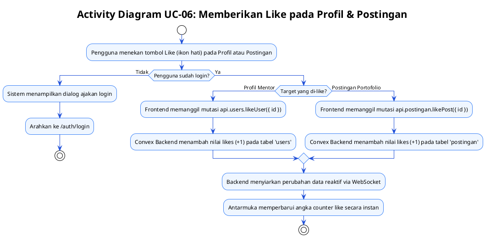
```plantuml
@startuml
!theme plain
skinparam ActivityBackgroundColor #EFF6FF
skinparam ActivityBorderColor #3B82F6
skinparam ArrowColor #1D4ED8

title Activity Diagram UC-06: Memberikan Like pada Profil & Postingan

start
:Pengguna menekan tombol Like (ikon hati) pada Profil atau Postingan;

if (Pengguna sudah login?) then (Tidak)
    :Sistem menampilkan dialog ajakan login;
    :Arahkan ke /auth/login;
    stop
else (Ya)
    if (Target yang di-like?) then (Profil Mentor)
        :Frontend memanggil mutasi api.users.likeUser({ id });
        :Convex Backend menambah nilai likes (+1) pada tabel 'users';
    else (Postingan Portofolio)
        :Frontend memanggil mutasi api.postingan.likePost({ id });
        :Convex Backend menambah nilai likes (+1) pada tabel 'postingan';
    endif
    :Backend menyiarkan perubahan data reaktif via WebSocket;
    :Antarmuka memperbarui angka counter like secara instan;
    stop
endif
@enduml
```

---

### 2.2.7 Activity Diagram UC-07: Mengelola Portofolio & Upload Karya (Ahli)

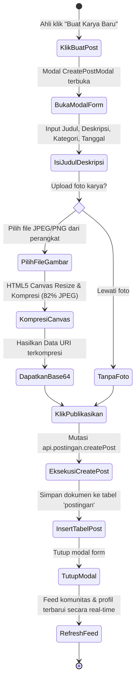
```mermaid
stateDiagram-v2
    [*] --> KlikBuatPost: Ahli klik "Buat Karya Baru"
    KlikBuatPost --> BukaModalForm: Modal CreatePostModal terbuka
    BukaModalForm --> IsiJudulDeskripsi: Input Judul, Deskripsi, Kategori, Tanggal
    
    state PilihFoto <<choice>>
    IsiJudulDeskripsi --> PilihFoto: Upload foto karya?
    PilihFoto --> PilihFileGambar: Pilih file JPEG/PNG dari perangkat
    PilihFileGambar --> KompresiCanvas: HTML5 Canvas Resize & Kompresi (82% JPEG)
    KompresiCanvas --> DapatkanBase64: Hasilkan Data URI terkompresi
    DapatkanBase64 --> KlikPublikasikan
    
    PilihFoto --> TanpaFoto: Lewati foto
    TanpaFoto --> KlikPublikasikan
    
    KlikPublikasikan --> EksekusiCreatePost: Mutasi api.postingan.createPost
    EksekusiCreatePost --> InsertTabelPost: Simpan dokumen ke tabel 'postingan'
    InsertTabelPost --> TutupModal: Tutup modal form
    TutupModal --> RefreshFeed: Feed komunitas & profil terbarui secara real-time
    RefreshFeed --> [*]
```

#### 📋 Prompt / Kode PlantUML: Activity Diagram UC-07
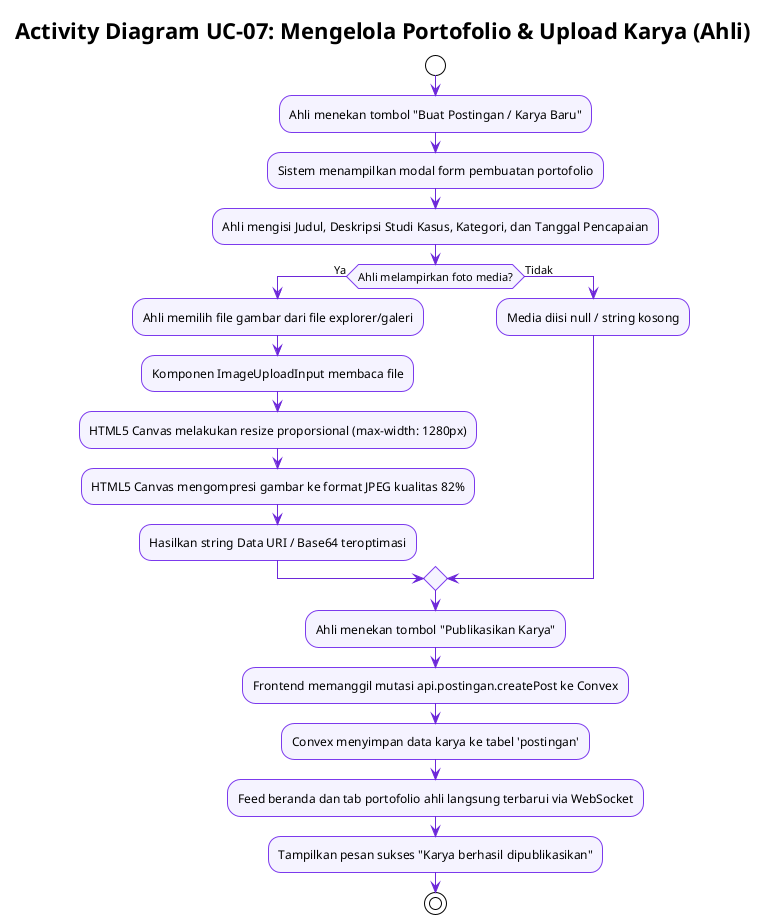
```plantuml
@startuml
!theme plain
skinparam ActivityBackgroundColor #F5F3FF
skinparam ActivityBorderColor #7C3AED
skinparam ArrowColor #6D28D9

title Activity Diagram UC-07: Mengelola Portofolio & Upload Karya (Ahli)

start
:Ahli menekan tombol "Buat Postingan / Karya Baru";
:Sistem menampilkan modal form pembuatan portofolio;
:Ahli mengisi Judul, Deskripsi Studi Kasus, Kategori, dan Tanggal Pencapaian;

if (Ahli melampirkan foto media?) then (Ya)
    :Ahli memilih file gambar dari file explorer/galeri;
    :Komponen ImageUploadInput membaca file;
    :HTML5 Canvas melakukan resize proporsional (max-width: 1280px);
    :HTML5 Canvas mengompresi gambar ke format JPEG kualitas 82%;
    :Hasilkan string Data URI / Base64 teroptimasi;
else (Tidak)
    :Media diisi null / string kosong;
endif

:Ahli menekan tombol "Publikasikan Karya";
:Frontend memanggil mutasi api.postingan.createPost ke Convex;
:Convex menyimpan data karya ke tabel 'postingan';
:Feed beranda dan tab portofolio ahli langsung terbarui via WebSocket;
:Tampilkan pesan sukses "Karya berhasil dipublikasikan";
stop
@enduml
```

---

### 2.2.8 Activity Diagram UC-08: Konsultasi Langsung via Real-Time Direct Chat

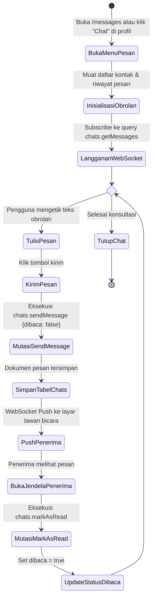
```mermaid
stateDiagram-v2
    [*] --> BukaMenuPesan: Buka /messages atau klik "Chat" di profil
    BukaMenuPesan --> InisialisasiObrolan: Muat daftar kontak & riwayat pesan
    InisialisasiObrolan --> LanggananWebSocket: Subscribe ke query chats.getMessages
    
    state SiklusChat <<choice>>
    LanggananWebSocket --> SiklusChat
    
    SiklusChat --> TulisPesan: Pengguna mengetik teks obrolan
    TulisPesan --> KirimPesan: Klik tombol kirim
    KirimPesan --> MutasiSendMessage: Eksekusi chats.sendMessage {dibaca: false}
    MutasiSendMessage --> SimpanTabelChats: Dokumen pesan tersimpan
    SimpanTabelChats --> PushPenerima: WebSocket Push ke layar lawan bicara
    
    PushPenerima --> BukaJendelaPenerima: Penerima melihat pesan
    BukaJendelaPenerima --> MutasiMarkAsRead: Eksekusi chats.markAsRead
    MutasiMarkAsRead --> UpdateStatusDibaca: Set dibaca = true
    UpdateStatusDibaca --> SiklusChat
    
    SiklusChat --> TutupChat: Selesai konsultasi
    TutupChat --> [*]
```

#### 📋 Prompt / Kode PlantUML: Activity Diagram UC-08
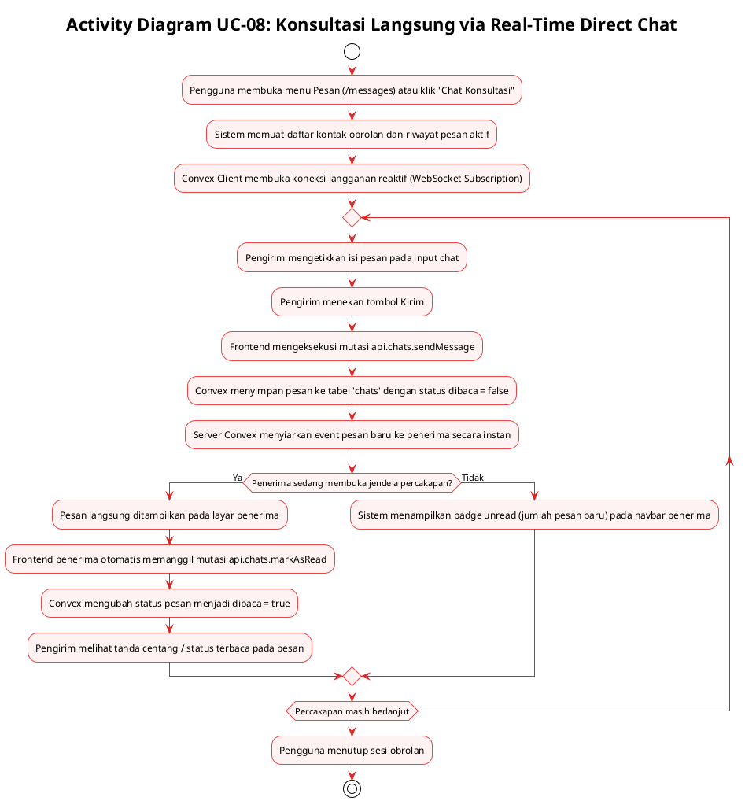
```plantuml
@startuml
!theme plain
skinparam ActivityBackgroundColor #FEF2F2
skinparam ActivityBorderColor #EF4444
skinparam ArrowColor #DC2626

title Activity Diagram UC-08: Konsultasi Langsung via Real-Time Direct Chat

start
:Pengguna membuka menu Pesan (/messages) atau klik "Chat Konsultasi";
:Sistem memuat daftar kontak obrolan dan riwayat pesan aktif;
:Convex Client membuka koneksi langganan reaktif (WebSocket Subscription);

repeat
    :Pengirim mengetikkan isi pesan pada input chat;
    :Pengirim menekan tombol Kirim;
    :Frontend mengeksekusi mutasi api.chats.sendMessage;
    :Convex menyimpan pesan ke tabel 'chats' dengan status dibaca = false;
    :Server Convex menyiarkan event pesan baru ke penerima secara instan;
    
    if (Penerima sedang membuka jendela percakapan?) then (Ya)
        :Pesan langsung ditampilkan pada layar penerima;
        :Frontend penerima otomatis memanggil mutasi api.chats.markAsRead;
        :Convex mengubah status pesan menjadi dibaca = true;
        :Pengirim melihat tanda centang / status terbaca pada pesan;
    else (Tidak)
        :Sistem menampilkan badge unread (jumlah pesan baru) pada navbar penerima;
    endif
repeat while (Percakapan masih berlanjut)

:Pengguna menutup sesi obrolan;
stop
@enduml
```

---

### 2.2.9 Activity Diagram UC-09: Memberikan Ulasan & Rating Bintang (Klien)

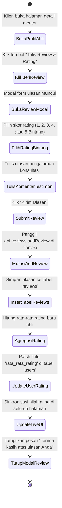
```mermaid
stateDiagram-v2
    [*] --> BukaProfilAhli: Klien buka halaman detail mentor
    BukaProfilAhli --> KlikBeriReview: Klik tombol "Tulis Review & Rating"
    KlikBeriReview --> BukaReviewModal: Modal form ulasan muncul
    BukaReviewModal --> PilihRatingBintang: Pilih skor rating (1, 2, 3, 4, atau 5 Bintang)
    PilihRatingBintang --> TulisKomentarTestimoni: Tulis ulasan pengalaman konsultasi
    TulisKomentarTestimoni --> SubmitReview: Klik "Kirim Ulasan"
    
    SubmitReview --> MutasiAddReview: Panggil api.reviews.addReview di Convex
    MutasiAddReview --> InsertTabelReviews: Simpan ulasan ke tabel 'reviews'
    InsertTabelReviews --> AgregasiRating: Hitung rata-rata rating baru ahli
    AgregasiRating --> UpdateUserRating: Patch field 'rata_rata_rating' di tabel 'users'
    UpdateUserRating --> UpdateLiveUI: Sinkronisasi nilai rating di seluruh halaman
    UpdateLiveUI --> TutupModalReview: Tampilkan pesan "Terima kasih atas ulasan Anda"
    TutupModalReview --> [*]
```

#### 📋 Prompt / Kode PlantUML: Activity Diagram UC-09
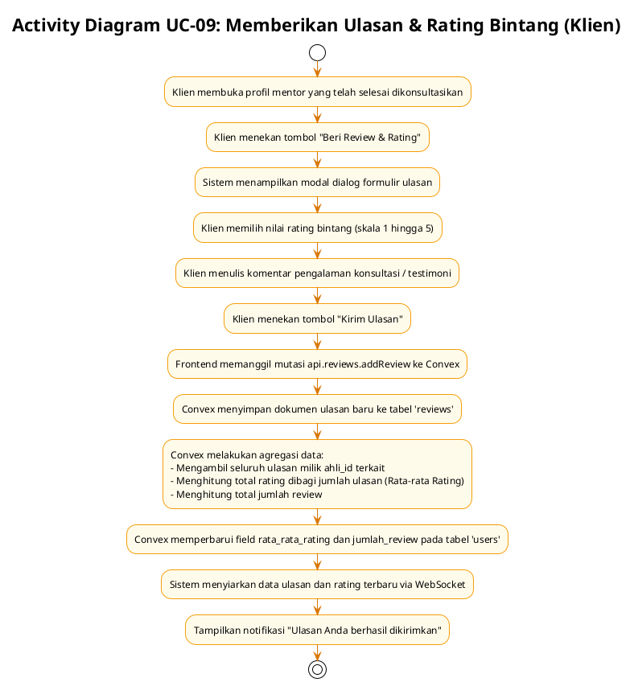
```plantuml
@startuml
!theme plain
skinparam ActivityBackgroundColor #FFFBEB
skinparam ActivityBorderColor #F59E0B
skinparam ArrowColor #D97706

title Activity Diagram UC-09: Memberikan Ulasan & Rating Bintang (Klien)

start
:Klien membuka profil mentor yang telah selesai dikonsultasikan;
:Klien menekan tombol "Beri Review & Rating";
:Sistem menampilkan modal dialog formulir ulasan;
:Klien memilih nilai rating bintang (skala 1 hingga 5);
:Klien menulis komentar pengalaman konsultasi / testimoni;
:Klien menekan tombol "Kirim Ulasan";

:Frontend memanggil mutasi api.reviews.addReview ke Convex;
:Convex menyimpan dokumen ulasan baru ke tabel 'reviews';

:Convex melakukan agregasi data:
- Mengambil seluruh ulasan milik ahli_id terkait
- Menghitung total rating dibagi jumlah ulasan (Rata-rata Rating)
- Menghitung total jumlah review;

:Convex memperbarui field rata_rata_rating dan jumlah_review pada tabel 'users';
:Sistem menyiarkan data ulasan dan rating terbaru via WebSocket;
:Tampilkan notifikasi "Ulasan Anda berhasil dikirimkan";
stop
@enduml
```

---

## 2.3 Sequence Diagram (Berdasarkan 9 Fitur Use Case)

### 2.3.1 Sequence Diagram UC-01: Registrasi Akun Baru

```mermaid
sequenceDiagram
    autonumber
    actor User as 👤 Pengguna Baru
    participant UI as 🖥️ Register Page (/auth/register)
    participant AuthContext as 🔐 AuthContext
    participant Convex as ☁️ Convex Serverless BaaS
    participant DB as 🗄️ Database (users)

    User->>UI: Isi form registrasi (Nama, Email, Pass, Role, GPS)
    User->>UI: Klik tombol "Daftar Akun"
    UI->>Convex: mutation(api.users.registerUser, {email, password, name, role, lat, lon})
    Convex->>DB: Query Index by_email (cek ketersediaan email)
    alt Email Sudah Ada
        DB-->>Convex: Return data user existing
        Convex-->>UI: Throw Error ("Email sudah terdaftar")
        UI-->>User: Tampilkan alert error "Email sudah terdaftar!"
    else Email Belum Ada (Valid)
        DB-->>Convex: Return null
        Convex->>DB: Insert document ke tabel 'users'
        DB-->>Convex: Return new_user_id
        Convex-->>UI: Return objek data pengguna baru
        UI->>AuthContext: loginUser(userData)
        AuthContext->>AuthContext: Simpan sesi ke LocalStorage & State
        UI-->>User: Redirect ke Beranda/Dashboard
    end
```

#### 📋 Prompt / Kode PlantUML: Sequence Diagram UC-01
```plantuml
@startuml
!theme plain
skinparam sequenceMessageAlign center

actor "Pengguna Baru" as User
participant "Register UI\n(Next.js)" as UI
participant "AuthContext\n(Client State)" as Auth
participant "Convex Backend\n(Server Mutation)" as Server
database "Tabel users\n(Convex DB)" as DB

User -> UI : Mengisi form registrasi & klik "Daftar"
UI -> Server : mutation(api.users.registerUser, payload)
Server -> DB : query("users").withIndex("by_email", email)

alt Email Telah Terdaftar
    DB --> Server : Dokumen ditemukan
    Server --> UI : Error: Email sudah digunakan
    UI --> User : Menampilkan notifikasi gagal
else Email Belum Terdaftar
    DB --> Server : Null (Tersedia)
    Server -> DB : insert("users", {email, password, name, role, latitude, longitude, ...})
    DB --> Server : ID Pengguna Baru
    Server --> UI : Return data user berhasil dibuat
    UI -> Auth : Simpan user aktif ke sesi lokal
    UI --> User : Berhasil masuk & diarahkan ke Dashboard
end
@enduml
```

---

### 2.3.2 Sequence Diagram UC-02: Login & Autentikasi Pengguna

```mermaid
sequenceDiagram
    autonumber
    actor User as 👤 Pengguna
    participant UI as 🖥️ Login Page (/auth/login)
    participant AuthContext as 🔐 AuthContext
    participant Convex as ☁️ Convex Serverless BaaS
    participant DB as 🗄️ Database (users)

    User->>UI: Input email & password, klik "Masuk"
    UI->>Convex: query(api.users.getUserByEmail, { email })
    Convex->>DB: Query Index by_email
    DB-->>Convex: Return dokumen user
    alt User Tidak Ditemukan
        Convex-->>UI: Return null
        UI-->>User: Tampilkan pesan "Email tidak terdaftar"
    else User Ditemukan
        Convex-->>UI: Return user data
        UI->>UI: Verifikasi kesesuaian password
        alt Password Salah
            UI-->>User: Tampilkan pesan "Password salah"
        else Password Benar
            UI->>AuthContext: loginUser(userData)
            AuthContext->>AuthContext: Set currentUser & save to storage
            UI-->>User: Redirect ke Dashboard
        end
    end
```

#### 📋 Prompt / Kode PlantUML: Sequence Diagram UC-02
```plantuml
@startuml
!theme plain
skinparam sequenceMessageAlign center

actor "Pengguna" as User
participant "Login UI\n(Next.js)" as UI
participant "AuthContext\n(Client State)" as Auth
participant "Convex Backend" as Server
database "Tabel users" as DB

User -> UI : Masukkan email & password, klik "Masuk"
UI -> Server : query(api.users.getUserByEmail, { email })
Server -> DB : query("users").withIndex("by_email", email).first()
DB --> Server : Return user document

alt User Tidak Ditemukan
    Server --> UI : Null
    UI --> User : Alert: Email tidak terdaftar
else User Ditemukan
    Server --> UI : Data User
    UI -> UI : Validasi password
    alt Password Tidak Cocok
        UI --> User : Alert: Kata sandi salah
    else Password Cocok
        UI -> Auth : loginUser(userData)
        Auth -> Auth : Simpan sesi aktif
        UI --> User : Berhasil login, navigasi ke Beranda
    end
end
@enduml
```

---

### 2.3.3 Sequence Diagram UC-03: Kelola Profil & Lokasi GPS

```mermaid
sequenceDiagram
    autonumber
    actor User as 👤 Pengguna
    participant UI as 🖥️ Profile Edit (/profile/edit)
    participant GeoAPI as 📍 HTML5 Geolocation API
    participant Convex as ☁️ Convex Serverless BaaS
    participant DB as 🗄️ Database (users)

    User->>UI: Ubah bio, telepon, skill, sertifikasi
    opt Perbarui Lokasi GPS
        User->>UI: Klik "Gunakan GPS Saya"
        UI->>GeoAPI: navigator.geolocation.getCurrentPosition()
        GeoAPI-->>UI: Return coordinates {latitude, longitude}
    end
    User->>UI: Klik "Simpan Perubahan"
    UI->>Convex: mutation(api.users.updateProfile, {id, bio, telepon, lat, lon, ...})
    Convex->>DB: ctx.db.patch(id, updateFields)
    DB-->>Convex: Update success
    Convex-->>UI: Return updated user
    UI-->>User: Notifikasi "Profil Berhasil Diperbarui!"
```

#### 📋 Prompt / Kode PlantUML: Sequence Diagram UC-03
```plantuml
@startuml
!theme plain
skinparam sequenceMessageAlign center

actor "Pengguna" as User
participant "Edit Profile UI" as UI
participant "Browser GPS API" as GPS
participant "Convex Backend" as Server
database "Tabel users" as DB

User -> UI : Mengubah data profil (Bio, Telepon, Kategori, Sertifikasi)
opt Update Titik Koordinat
    User -> UI : Klik tombol "Gunakan Lokasi GPS Saya"
    UI -> GPS : getCurrentPosition()
    GPS --> UI : Koordinat Lintang & Bujur Baru
end
User -> UI : Klik "Simpan Perubahan"
UI -> Server : mutation(api.users.updateProfile, payload)
Server -> DB : ctx.db.patch(userId, payload)
DB --> Server : Patch acknowledged
Server --> UI : Status berhasil & data profil terbaru
UI --> User : Menampilkan toast "Profil Berhasil Diperbarui"
@enduml
```

---

### 2.3.4 Sequence Diagram UC-04: Penelusuran Peta & Filter Radius Geospasial

```mermaid
sequenceDiagram
    autonumber
    actor Client as 👤 Klien
    participant UI as 🖥️ Find Page (/find)
    participant GeoService as 📐 Geo Engine (Haversine)
    participant Convex as ☁️ Convex Serverless BaaS
    participant DB as 🗄️ Database (users)
    participant Leaflet as 🗺️ Leaflet Map View

    Client->>UI: Akses halaman /find
    UI->>Convex: query(api.users.listExperts)
    Convex->>DB: query("users").withIndex("by_role", "AHLI")
    DB-->>Convex: Return array data ahli
    Convex-->>UI: List seluruh mentor ahli aktif
    UI->>GeoService: calculateDistance(userCoord, expertCoords)
    GeoService-->>UI: Return array ahli + field distanceKm & ETA
    UI->>Leaflet: Render User Pin, Radius Circle, & Expert Markers
    
    Client->>UI: Geser Slider Radius (misal: 15 km) & Pilih Kategori
    UI->>UI: Filter array (distance <= 15 && kategori == selected)
    UI->>Leaflet: Re-render marker yang memenuhi kriteria
    UI-->>Client: Tampilkan daftar kartu ahli terdekat
```

#### 📋 Prompt / Kode PlantUML: Sequence Diagram UC-04
```plantuml
@startuml
!theme plain
skinparam sequenceMessageAlign center

actor "Klien" as Client
participant "Find Page UI\n(Next.js)" as UI
participant "GeoService\n(Haversine & ETA)" as Geo
participant "Convex Backend" as Server
database "Tabel users" as DB
participant "Leaflet Map Engine" as Map

Client -> UI : Buka halaman penelusuran (/find)
UI -> Server : query(api.users.listExperts)
Server -> DB : query("users").withIndex("by_role", "AHLI").collect()
DB --> Server : Data seluruh mentor
Server --> UI : Kembalikan array ahli aktif
UI -> Geo : Hitung jarak tiap ahli dari koordinat Klien
Geo --> UI : Array ahli + distance (km) + estimasi ETA
UI -> Map : Gambar User Marker, Lingkaran Radius, Pin Mentor

Client -> UI : Menggeser slider radius (contoh: 20 km)
UI -> UI : Filter array ahli (jarak <= 20 km)
UI -> Map : Perbarui visualisasi marker aktif
UI --> Client : Menampilkan daftar kartu ahli yang cocok
@enduml
```

---

### 2.3.5 Sequence Diagram UC-05: Melihat Detail Profil & Portofolio Ahli

```mermaid
sequenceDiagram
    autonumber
    actor User as 👤 Pengguna
    participant UI as 🖥️ Expert Detail (/experts/[id])
    participant Convex as ☁️ Convex Serverless BaaS
    participant DB as 🗄️ Database (users, postingan, reviews)

    User->>UI: Klik profil mentor terpilih
    par Ambil Data Profil Ahli
        UI->>Convex: query(api.users.getUserById, { id })
        Convex->>DB: query("users").get(id)
        DB-->>Convex: Return data profil ahli
        Convex-->>UI: Data profil lengkap
    and Ambil Data Portofolio
        UI->>Convex: query(api.postingan.getPostsByAhli, { ahli_id: id })
        Convex->>DB: query("postingan").withIndex("by_ahli", id)
        DB-->>Convex: Return kumpulan karya
        Convex-->>UI: Data postingan portofolio
    and Ambil Data Ulasan
        UI->>Convex: query(api.reviews.getReviewsByExpert, { ahli_id: id })
        Convex->>DB: query("reviews").withIndex("by_ahli", id)
        DB-->>Convex: Return kumpulan testimoni
        Convex-->>UI: Data ulasan & rating bintang
    end
    UI-->>User: Tampilkan Halaman Detail Profil Lengkap
```

#### 📋 Prompt / Kode PlantUML: Sequence Diagram UC-05
```plantuml
@startuml
!theme plain
skinparam sequenceMessageAlign center

actor "Pengguna" as User
participant "Expert Detail UI\n(/experts/[id])" as UI
participant "Convex Backend" as Server
database "Convex Database" as DB

User -> UI : Membuka halaman detail mentor
par Query Detail Profil
    UI -> Server : query(api.users.getUserById, { id })
    Server -> DB : ctx.db.get(id)
    DB --> Server : Dokumen ahli
    Server --> UI : Data profil, bio, sertifikasi
else Query Portofolio
    UI -> Server : query(api.postingan.getPostsByAhli, { ahli_id })
    Server -> DB : query("postingan").withIndex("by_ahli", ahli_id)
    DB --> Server : Daftar postingan karya
    Server --> UI : Data artikel & studi kasus
else Query Ulasan Klien
    UI -> Server : query(api.reviews.getReviewsByExpert, { ahli_id })
    Server -> DB : query("reviews").withIndex("by_ahli", ahli_id)
    DB --> Server : Daftar testimoni ulasan
    Server --> UI : Data ulasan & bintang rating
end
UI --> User : Render halaman detail komprehensif
@enduml
```

---

### 2.3.6 Sequence Diagram UC-06: Memberikan Like pada Profil & Postingan

```mermaid
sequenceDiagram
    autonumber
    actor User as 👤 Pengguna
    participant UI as 🖥️ Next.js Web App
    participant Convex as ☁️ Convex Serverless BaaS
    participant DB as 🗄️ Database (users & postingan)

    alt Like Profil Ahli
        User->>UI: Klik ikon hati di Profil Mentor
        UI->>Convex: mutation(api.users.likeUser, { id: ahli_id })
        Convex->>DB: ctx.db.patch(ahli_id, { likes: currentLikes + 1 })
        DB-->>Convex: Updated
        Convex-->>UI: WebSocket Push event (like updated)
        UI-->>User: Counter like profil bertambah secara instan
    else Like Postingan Karya
        User->>UI: Klik ikon jempol/hati di PostCard
        UI->>Convex: mutation(api.postingan.likePost, { id: post_id })
        Convex->>DB: ctx.db.patch(post_id, { likes: currentLikes + 1 })
        DB-->>Convex: Updated
        Convex-->>UI: WebSocket Push event (like updated)
        UI-->>User: Counter like postingan bertambah secara instan
    end
```

#### 📋 Prompt / Kode PlantUML: Sequence Diagram UC-06
```plantuml
@startuml
!theme plain
skinparam sequenceMessageAlign center

actor "Pengguna" as User
participant "Frontend UI" as UI
participant "Convex Backend" as Server
database "Convex Database" as DB

alt Like Profil Ahli
    User -> UI : Klik tombol Like Profil
    UI -> Server : mutation(api.users.likeUser, { id: ahliId })
    Server -> DB : ctx.db.patch(ahliId, { likes: current + 1 })
    DB --> Server : Patch confirmed
    Server -->> UI : Real-time update via WebSocket
    UI --> User : Counter like profil terbarui
else Like Postingan Karya
    User -> UI : Klik tombol Like Postingan
    UI -> Server : mutation(api.postingan.likePost, { id: postId })
    Server -> DB : ctx.db.patch(postId, { likes: current + 1 })
    DB --> Server : Patch confirmed
    Server -->> UI : Real-time update via WebSocket
    UI --> User : Counter like postingan terbarui
end
@enduml
```

---

### 2.3.7 Sequence Diagram UC-07: Mengelola Portofolio & Upload Karya (Ahli)

```mermaid
sequenceDiagram
    autonumber
    actor Expert as 👨‍💼 Ahli (Mentor)
    participant UI as 🖥️ CreatePostModal
    participant Canvas as 🖼️ HTML5 Canvas Compressor
    participant Convex as ☁️ Convex Serverless BaaS
    participant DB as 🗄️ Database (postingan)

    Expert->>UI: Buka form karya baru, isi judul & deskripsi
    opt Lampirkan Foto Karya
        Expert->>UI: Pilih gambar dari file explorer
        UI->>Canvas: Gambar citra ke elemen Canvas & resize (max 1280px)
        Canvas->>Canvas: Kompresi JPEG kualitas 82%
        Canvas-->>UI: Return compressed Data URI (Base64)
    end
    Expert->>UI: Klik "Publikasikan Karya"
    UI->>Convex: mutation(api.postingan.createPost, {ahli_id, judul, deskripsi, media, kategori, ...})
    Convex->>DB: ctx.db.insert("postingan", payload)
    DB-->>Convex: Return new_post_id
    Convex-->>UI: Konfirmasi publikasi sukses
    Convex-->>UI: WebSocket Push feed baru ke seluruh klien aktif
    UI-->>Expert: Notifikasi "Karya Berhasil Dipublikasikan!"
```

#### 📋 Prompt / Kode PlantUML: Sequence Diagram UC-07
```plantuml
@startuml
!theme plain
skinparam sequenceMessageAlign center

actor "Ahli (Mentor)" as Expert
participant "CreatePostModal UI" as UI
participant "HTML5 Canvas" as Canvas
participant "Convex Backend" as Server
database "Tabel postingan" as DB

Expert -> UI : Mengisi form (Judul, Deskripsi, Kategori, Tanggal)
opt Unggah Foto Portofolio
    Expert -> UI : Pilih berkas foto resolusi tinggi
    UI -> Canvas : Gambar file ke objek Image & Canvas
    Canvas -> Canvas : Resize dimensi & kompresi format JPEG (0.82)
    Canvas --> UI : Kembalikan string Data URI terkompresi
end
Expert -> UI : Klik tombol "Publikasikan Karya"
UI -> Server : mutation(api.postingan.createPost, postData)
Server -> DB : ctx.db.insert("postingan", postData)
DB --> Server : ID Postingan Baru
Server --> UI : Status sukses
Server -->> UI : Siarkan postingan baru ke Feed Komunitas via WebSocket
UI --> Expert : Tutup modal & tampilkan konfirmasi sukses
@enduml
```

---

### 2.3.8 Sequence Diagram UC-08: Konsultasi Langsung via Real-Time Direct Chat

```mermaid
sequenceDiagram
    autonumber
    actor Client as 👤 Klien (Pengirim)
    participant UI_Client as 🖥️ Chat Window Klien
    participant ConvexWS as ⚡ Convex WebSocket Sync
    participant ConvexBackend as ☁️ Convex Server Functions
    database DB as 🗄️ Tabel chats
    participant UI_Expert as 🖥️ Chat Window Ahli
    actor Expert as 👨‍💼 Ahli (Penerima)

    Client->>UI_Client: Ketik pesan konsultasi & klik "Kirim"
    UI_Client->>ConvexBackend: mutation(api.chats.sendMessage, {pengirim, penerima, isi_pesan})
    ConvexBackend->>DB: ctx.db.insert("chats", {pengirim_id, penerima_id, isi_pesan, dibaca: false, created_at})
    DB-->>ConvexBackend: Return chat_id
    ConvexBackend-->>UI_Client: Konfirmasi pesan terkirim
    ConvexBackend->>ConvexWS: Push data pesan baru ke channel penerima
    ConvexWS-->>UI_Expert: Render pesan baru pada layar Ahli
    Expert->>UI_Expert: Membaca pesan di jendela obrolan
    UI_Expert->>ConvexBackend: mutation(api.chats.markAsRead, {pengirim_id, penerima_id})
    ConvexBackend->>DB: ctx.db.patch(chat_id, {dibaca: true})
    ConvexBackend->>ConvexWS: Push status pesan terbaca ke Pengirim
    ConvexWS-->>UI_Client: Perbarui indikator centang/baca (Read Receipt)
```

#### 📋 Prompt / Kode PlantUML: Sequence Diagram UC-08
```plantuml
@startuml
!theme plain
skinparam sequenceMessageAlign center

actor "Klien (Pengirim)" as Client
participant "Frontend Klien" as UI1
participant "Convex WebSocket" as WS
participant "Convex Server" as Server
database "Tabel chats" as DB
participant "Frontend Ahli" as UI2
actor "Ahli (Penerima)" as Expert

Client -> UI1 : Ketik pesan & klik "Kirim"
UI1 -> Server : mutation(api.chats.sendMessage, {pengirim_id, penerima_id, isi_pesan})
Server -> DB : ctx.db.insert("chats", {..., dibaca: false, created_at})
DB --> Server : ID Pesan
Server --> UI1 : Status pesan terkirim
Server -> WS : Push event pesan baru ke penerima
WS --> UI2 : Render gelembung pesan baru secara real-time
Expert -> UI2 : Melihat pesan masuk
UI2 -> Server : mutation(api.chats.markAsRead, {pengirim_id, penerima_id})
Server -> DB : ctx.db.patch(chatId, {dibaca: true})
Server -> WS : Push event status terbaca ke pengirim
WS --> UI1 : Perbarui status tanda centang pesan terbaca
@enduml
```

---

### 2.3.9 Sequence Diagram UC-09: Memberikan Ulasan & Rating Bintang (Klien)

```mermaid
sequenceDiagram
    autonumber
    actor Client as 👤 Klien
    participant UI as 🖥️ ReviewModal
    participant Convex as ☁️ Convex Serverless BaaS
    participant DB_Rev as 🗄️ Tabel reviews
    participant DB_User as 🗄️ Tabel users

    Client->>UI: Pilih 5 Bintang, isi testimoni, klik "Kirim Review"
    UI->>Convex: mutation(api.reviews.addReview, {user_id, ahli_id, rating: 5, komentar})
    Convex->>DB_Rev: ctx.db.insert("reviews", {user_id, ahli_id, rating: 5, komentar, created_at})
    DB_Rev-->>Convex: Return review_id
    Convex->>DB_Rev: query("reviews").withIndex("by_ahli", ahli_id).collect()
    DB_Rev-->>Convex: Return seluruh list ulasan milik ahli tersebut
    Convex->>Convex: Hitung total skor / jumlah ulasan (Rata-rata Rating baru)
    Convex->>DB_User: ctx.db.patch(ahli_id, {rata_rata_rating: avgScore, jumlah_review: totalCount})
    DB_User-->>Convex: Update profile rating confirmed
    Convex-->>UI: Return hasil ulasan sukses
    Convex-->>UI: WebSocket Push update rating profil ke seluruh pengguna
    UI-->>Client: Tampilkan notifikasi "Ulasan Anda Berhasil Disimpan!"
```

#### 📋 Prompt / Kode PlantUML: Sequence Diagram UC-09
```plantuml
@startuml
!theme plain
skinparam sequenceMessageAlign center

actor "Klien" as Client
participant "ReviewModal UI" as UI
participant "Convex Server" as Server
database "Tabel reviews" as DB_R
database "Tabel users" as DB_U

Client -> UI : Memilih bintang (1-5) & menulis komentar review
Client -> UI : Klik "Kirim Ulasan"
UI -> Server : mutation(api.reviews.addReview, {user_id, ahli_id, rating, komentar})
Server -> DB_R : ctx.db.insert("reviews", payload)
DB_R --> Server : ID Review Baru

Server -> DB_R : query("reviews").withIndex("by_ahli", ahli_id).collect()
DB_R --> Server : Kumpulan semua review milik mentor

Server -> Server : Kalkulasi rata-rata rating (sum(ratings) / count)
Server -> DB_U : ctx.db.patch(ahli_id, {rata_rata_rating: avg, jumlah_review: count})
DB_U --> Server : Profil mentor terbarui

Server --> UI : Konfirmasi mutasi sukses
Server -->> UI : Siarkan perubahan rating ke seluruh klien via WebSocket
UI --> Client : Notifikasi sukses "Ulasan Berhasil Disimpan"
@enduml
```

---

## 2.4 Class Diagram

### Visualisasi Class Diagram Sistem
Model konseptual berorientasi objek yang merepresentasikan entitas sistem, relasi, tipe data, serta metodenya.

```mermaid
classDiagram
    class User {
        +String _id
        +String email
        +String password
        +String name
        +UserRole role
        +Float latitude
        +Float longitude
        +String avatar
        +String lokasi_nama
        +String telepon
        +Boolean verified
        +Int likes
        +Boolean is_active
        +Number created_at
        +register()
        +login()
        +updateProfile()
        +likeProfile()
    }

    class Ahli {
        +String kategori_keahlian
        +String deskripsi_bio
        +Float rata_rata_rating
        +Int jumlah_review
        +Int pengalaman_tahun
        +List~String~ keahlian_tags
        +String pendidikan
        +List~String~ sertifikasi
        +buatPortofolio()
        +balasKonsultasi()
    }

    class UserBiasa {
        +cariAhliTerdekat()
        +filterRadius()
        +kirimUlasan()
        +mulaiKonsultasi()
    }

    class Postingan {
        +String _id
        +String ahli_id
        +String judul
        +String deskripsi
        +String media
        +String kategori
        +String tanggal_pencapaian
        +Int likes
        +List~String~ tags
        +Number created_at
        +createPost()
        +updatePost()
        +deletePost()
        +likePost()
    }

    class ChatMessage {
        +String _id
        +String pengirim_id
        +String penerima_id
        +String isi_pesan
        +Boolean dibaca
        +Number created_at
        +sendMessage()
        +markAsRead()
    }

    class Review {
        +String _id
        +String user_id
        +String ahli_id
        +Number rating
        +String komentar
        +Number created_at
        +addReview()
        +getReviewsByExpert()
    }

    class GeoService {
        +calculateDistance(lat1, lon1, lat2, lon2) Float
        +calculateETA(distanceKm) String
        +filterByRadius(users, userLat, userLon, radiusKm) List
    }

    User <|-- Ahli : Inheritance
    User <|-- UserBiasa : Inheritance
    Ahli "1" *-- "0..*" Postingan : Publishes
    User "1" <-- "0..*" ChatMessage : Sender
    User "1" <-- "0..*" ChatMessage : Receiver
    UserBiasa "1" -- "0..*" Review : Writes
    Ahli "1" <-- "0..*" Review : Receives
    UserBiasa ..> GeoService : Uses for Calculation
```

### 📋 Prompt / Kode PlantUML untuk Class Diagram

```plantuml
@startuml
!theme plain
skinparam classAttributeIconSize 0
skinparam class {
    BackgroundColor #FFFFFF
    BorderColor #2563EB
    ArrowColor #1D4ED8
}

enum UserRole {
    USER_BIASA
    AHLI
}

class User {
    +String _id
    +String email
    +String password
    +String name
    +UserRole role
    +Double latitude
    +Double longitude
    +String avatar
    +String lokasi_nama
    +String telepon
    +Boolean verified
    +Integer likes
    +Boolean is_active
    +Long created_at
    +register()
    +login()
    +updateProfile()
    +likeProfile()
}

class Ahli {
    +String kategori_keahlian
    +String deskripsi_bio
    +Double rata_rata_rating
    +Integer jumlah_review
    +Integer pengalaman_tahun
    +List<String> keahlian_tags
    +String pendidikan
    +List<String> sertifikasi
    +buatPortofolio()
    +balasKonsultasi()
}

class UserBiasa {
    +cariAhliTerdekat()
    +filterRadius()
    +kirimUlasan()
    +mulaiKonsultasi()
}

class Postingan {
    +String _id
    +String ahli_id
    +String judul
    +String deskripsi
    +String media
    +String kategori
    +String tanggal_pencapaian
    +Integer likes
    +List<String> tags
    +Long created_at
    +createPost()
    +updatePost()
    +deletePost()
    +likePost()
}

class ChatMessage {
    +String _id
    +String pengirim_id
    +String penerima_id
    +String isi_pesan
    +Boolean dibaca
    +Long created_at
    +sendMessage()
    +markAsRead()
}

class Review {
    +String _id
    +String user_id
    +String ahli_id
    +Double rating
    +String komentar
    +Long created_at
    +addReview()
    +getReviewsByExpert()
}

class GeoService <<Utility>> {
    +Double calculateDistance(Double lat1, Double lon1, Double lat2, Double lon2)
    +String calculateETA(Double distanceKm)
    +List<User> filterByRadius(List<User> users, Double uLat, Double uLon, Double radiusKm)
}

User <|-- Ahli
User <|-- UserBiasa
Ahli "1" *-- "0..*" Postingan : Mempublikasikan
User "1" <-- "0..*" ChatMessage : Pengirim
User "1" <-- "0..*" ChatMessage : Penerima
UserBiasa "1" -- "0..*" Review : Menulis
Ahli "1" <-- "0..*" Review : Menerima
UserBiasa ..> GeoService : Menggunakan
@enduml
```

---

## 2.5 Desain Arsitektur Sistem

### 2.5.1 Skema Client-Server

Sistem FTE dibangun menggunakan arsitektur modern **Jamstack & Reactive Backend-as-a-Service (BaaS)** yang memisahkan presentasi antarmuka klien dan pemrosesan serverless secara efisien:

```mermaid
graph TD
    subgraph Client_Tier ["Client Tier (Browser & Perangkat Pengguna)"]
        Browser["🖥️ Web Browser (Next.js 14 Client App)"]
        UI_Components["React Components & Pages (/find, /messages, /profile)"]
        Context["AuthContext & DataContext (State Management)"]
        LeafletMap["Leaflet Map Engine & Canvas Compressor"]
        Browser --> UI_Components --> Context --> LeafletMap
    end

    subgraph Protocol_Tier ["Communication Tier (Protokol Jaringan)"]
        WS_Conn["⚡ WebSocket Connection (Real-Time Reactive Subscriptions)"]
        HTTP_Conn["🌐 HTTPS POST (Transactional Mutations & Queries)"]
    end

    subgraph Server_Tier ["Serverless BaaS Tier (Convex Cloud)"]
        ConvexGateway["Convex Engine & API Gateway"]
        ServerFunctions["Server Functions (users.ts, postingan.ts, chats.ts, reviews.ts)"]
        Validation["Type-Safe Schema Validator (v.string, v.number)"]
        ConvexGateway --> ServerFunctions --> Validation
    end

    subgraph Database_Tier ["Database & Storage Tier"]
        DB_Users[("📑 Table: users")]
        DB_Posts[("📑 Table: postingan")]
        DB_Chats[("📑 Table: chats")]
        DB_Reviews[("📑 Table: reviews")]
        Validation --> DB_Users
        Validation --> DB_Posts
        Validation --> DB_Chats
        Validation --> DB_Reviews
    end

    Client_Tier <--> WS_Conn <--> Server_Tier
    Client_Tier <--> HTTP_Conn <--> Server_Tier
```

---

### 2.5.2 Integrasi API dan Pihak Ketiga

| No | Integrasi API / Pihak Ketiga | Fungsi Teknis dalam Sistem | Mekanisme Integrasi |
|:---|:---|:---|:---|
| 1 | **OpenStreetMap Tile Server API** | Menyediakan *tiles layer* peta kartografi dunia secara gratis dan presisi (`https://{s}.tile.openstreetmap.org/{z}/{x}/{y}.png`). | Dimuat langsung oleh komponen `react-leaflet` untuk visualisasi peta. |
| 2 | **W3C HTML5 Geolocation API** | Mengambil titik koordinat lintang (*latitude*) dan bujur (*longitude*) perangkat pengguna secara presisi melalui sensor GPS/Jaringan. | Dipanggil via `navigator.geolocation.getCurrentPosition()` pada `AuthContext`. |
| 3 | **HTML5 Canvas Compression API** | Melakukan *resizing* dan kompresi citra foto profil serta portofolio di sisi peramban klien sebelum transmisi jaringan. | Komponen `ImageUploadInput.tsx` menggunakan `canvas.toDataURL('image/jpeg', 0.82)`. |
| 4 | **Convex Cloud Sync Protocol** | Menyediakan sinkronisasi data reaktif dua arah (*two-way reactive data synchronization*) berbasis WebSocket. | Dikelola melalui pustaka resmi `convex/react` dan `ConvexClientProvider`. |
| 5 | **Lucide Icons Library** | Paket ikonografi antarmuka berbasis vektor SVG yang ringan dan konsisten. | Komponen React modular dari `lucide-react`. |

---

## 2.6 Desain Database

### Entity Relationship Diagram (ERD)

Database FTE menggunakan basis data dokumen terstruktur (*reactive document store*) yang didefinisikan pada file [`convex/schema.ts`](file:///d:/KAMPUS/SEMESTER%205/SOFENG/project%20FTE/convex/schema.ts).

```mermaid
erDiagram
    USERS ||--o{ POSTINGAN : "ahli mempublikasikan"
    USERS ||--o{ CHATS : "pengirim pesan"
    USERS ||--o{ CHATS : "penerima pesan"
    USERS ||--o{ REVIEWS : "klien menulis"
    USERS ||--o{ REVIEWS : "ahli menerima"

    USERS {
        string _id PK
        string email UK
        string password
        string name
        string role "USER_BIASA | AHLI"
        number latitude
        number longitude
        string avatar
        string lokasi_nama
        string kategori_keahlian
        string deskripsi_bio
        number rata_rata_rating
        number jumlah_review
        number pengalaman_tahun
        string telepon
        boolean verified
        number likes
        array keahlian_tags
        string pendidikan
        array sertifikasi
        boolean is_active
        number created_at
    }

    POSTINGAN {
        string _id PK
        string ahli_id FK
        string judul
        string deskripsi
        string media
        string kategori
        string tanggal_pencapaian
        number likes
        array tags
        number created_at
    }

    CHATS {
        string _id PK
        string pengirim_id FK
        string penerima_id FK
        string isi_pesan
        boolean dibaca
        number created_at
    }

    REVIEWS {
        string _id PK
        string user_id FK
        string ahli_id FK
        number rating "1.0 - 5.0"
        string komentar
        number created_at
    }
```

### 📋 Prompt / Kode PlantUML untuk Database ERD

```plantuml
@startuml
!theme plain
skinparam linetype ortho
skinparam entity {
    BackgroundColor #F8FAFC
    BorderColor #334155
}

entity "users" as users {
    * **_id** : string <<PK>>
    --
    * **email** : string <<UK, Index: by_email>>
    password : string
    * **name** : string
    * **role** : string <<Index: by_role>> ("USER_BIASA" | "AHLI")
    * **latitude** : number
    * **longitude** : number
    avatar : string
    lokasi_nama : string
    kategori_keahlian : string <<Index: by_kategori>>
    deskripsi_bio : string
    rata_rata_rating : number
    jumlah_review : number
    pengalaman_tahun : number
    telepon : string
    verified : boolean
    likes : number
    keahlian_tags : array<string>
    pendidikan : string
    sertifikasi : array<string>
    is_active : boolean
    created_at : number
}

entity "postingan" as postingan {
    * **_id** : string <<PK>>
    --
    * **ahli_id** : string <<FK, Index: by_ahli>>
    * **judul** : string
    * **deskripsi** : string
    media : string
    kategori : string <<Index: by_kategori>>
    tanggal_pencapaian : string
    likes : number
    tags : array<string>
    created_at : number
}

entity "chats" as chats {
    * **_id** : string <<PK>>
    --
    * **pengirim_id** : string <<FK, Index: by_pengirim>>
    * **penerima_id** : string <<FK, Index: by_penerima>>
    * **isi_pesan** : string
    * **dibaca** : boolean
    * **created_at** : number
}

entity "reviews" as reviews {
    * **_id** : string <<PK>>
    --
    * **user_id** : string <<FK, Index: by_user>>
    * **ahli_id** : string <<FK, Index: by_ahli>>
    * **rating** : number
    * **komentar** : string
    * **created_at** : number
}

users ||..o{ postingan : "1 ahli memiliki banyak postingan"
users ||..o{ chats : "pengirim pesan"
users ||..o{ chats : "penerima pesan"
users ||..o{ reviews : "klien membuat ulasan"
users ||..o{ reviews : "ahli menerima ulasan"
@enduml
```

---

# BAB 3: IMPLEMENTASI

## 3.1 Spesifikasi Lingkungan Pengembangan & Produksi

### 1. Bahasa Pemrograman & Markup
* **TypeScript (v5.x)**: Bahasa utama yang digunakan pada seluruh komponen antarmuka, konteks, logika utilitas geospasial, hingga fungsi backend Convex. TypeScript menjamin keandalan kode (*type-safety*) dan meminimalisir kesalahan *runtime*.
* **JavaScript (ECMAScript 2022+ / ES6+)**: Eksekusi logika asinkron modern (*async/await*, *destructuring*, *spread operators*).
* **HTML5**: Struktur semantik elemen web (`<main>`, `<header>`, `<section>`, `<nav>`, `<article>`, `<canvas>`).
* **CSS3**: Variabel kustom HSL, utilitas tata letak Flexbox dan CSS Grid, efek *glassmorphism backdrop-blur*, serta animasi transisi visual.

---

### 2. Framework & Library Frontend
* **Next.js 14 (v14.2.24 - App Router)**: Framework React tingkat lanjut dengan struktur direktori berbasis rute file (`src/app/`), pemisahan *Client Component* (`'use client'`) dan *Server Component*, optimasi font, dan rendering performa tinggi.
* **React 18 (v18.3.1) & React DOM**: Pustaka inti pembangun antarmuka deklaratif berbasis komponen modular dan hooks reaktif (`useState`, `useEffect`, `useCallback`, `useMemo`, `useContext`).
* **Tailwind CSS (v3.4.17)**: Framework CSS *utility-first* untuk penataan gaya modern, responsif, dan konsisten dengan dukungan tema dinamis *Dark/Light Mode*.
* **Leaflet (v1.9.4) & React-Leaflet (v4.2.1)**: Pustaka pemetaan interaktif sumber terbuka yang mendukung layer OpenStreetMap, marker pin kustom dengan avatar pengguna, tooltip, popup, serta overlay lingkaran radius pencarian.
* **Lucide React (v0.475.0)**: Koleksi ikon antarmuka berbasis vektor SVG yang bersih, ringan, dan seragam.
* **clsx & tailwind-merge**: Utilitas kondisional untuk penggabungan *class name* Tailwind CSS secara dinamis tanpa konflik gaya.

---

### 3. Backend & Database
* **Convex Cloud Backend-as-a-Service (v1.45.0)**:
  * **Reactive Database Engine**: Database dokumen NoSQL yang secara otomatis memicu pembaruan antarmuka (*live subscription*) saat data berubah tanpa perlu me-refresh halaman.
  * **Convex Server Functions**: Fungsi serverless terisolasi (`query` untuk pembacaan data dan `mutation` untuk penulisan data transaksional berstatus ACID).
  * **Type-Safe Validation**: Validator bawaan Convex (`v.string()`, `v.number()`, `v.boolean()`, `v.array()`, `v.union()`) yang memvalidasi setiap masukan data sebelum dieksekusi ke database.
  * **Indexed Queries**: Optimalisasi pengambilan data cepat melalui indeks database (`by_email`, `by_role`, `by_kategori`, `by_ahli`, `by_user`, `by_pengirim`, `by_penerima`).

---

### 4. Integrasi API Pihak Ketiga
* **OpenStreetMap Tile API Server**: Sumber penyedia citra peta kartografi digital publik global.
* **W3C Geolocation Browser API**: Penyedia akses koordinat lintang & bujur GPS perangkat secara real-time.
* **HTML5 Canvas Compression API**: Engine kompresi grafis sisi klien yang mengonversi foto resolusi tinggi menjadi format JPEG optimal sebelum disimpan ke database.

---

### 5. Alat Pengembangan (Development Tools)
* **Visual Studio Code (VS Code) / Antigravity IDE**: Editor kode sumber terintegrasi dengan ekstensi TypeScript, Tailwind CSS IntelliSense, ESLint, dan Prettier.
* **Node.js (LTS v18.17+ / v20.x)**: Lingkungan runtime JavaScript untuk eksekusi package manager dan server pengembangan lokal.
* **Node Package Manager (npm)**: Alat manajemen dependensi pustaka perangkat lunak.
* **Git & GitHub**: Sistem kontrol versi (*Version Control System*) untuk pelacakan riwayat perubahan kode sumber dan kolaborasi tim.
* **Convex CLI (`npx convex dev`)**: Alat baris perintah untuk sinkronisasi lokal dan deployment instan fungsi server serta skema basis data ke Convex Cloud.
* **PlantUML / draw.io**: Perangkat pemodelan visual untuk merancang dan mendokumentasikan diagram UML (Use Case, Activity, Sequence, Class, Arsitektur, dan Database ERD).

---

## 3.2 Panduan Menjalankan Sistem Secara Lokal

1. **Instalasi Dependensi**:
   ```bash
   npm install
   ```
2. **Menjalankan Backend Convex (Mode Sinkronisasi)**:
   ```bash
   npx convex dev
   ```
3. **Menjalankan Aplikasi Frontend Next.js**:
   ```bash
   npm run dev
   ```
4. **Membuka Aplikasi pada Peramban**:
   Akses `http://localhost:3000` pada peramban web pilihan Anda.

---

# 👨‍💻 Hak Cipta & Pengembang
* **Mata Kuliah**: Rekayasa Perangkat Lunak (Software Engineering) - Semester 5
* **Proyek**: Find The Expert (FTE) - Platform Mentoring & Kolaborasi Geospasial
* **Tahun Akademik**: 2026
